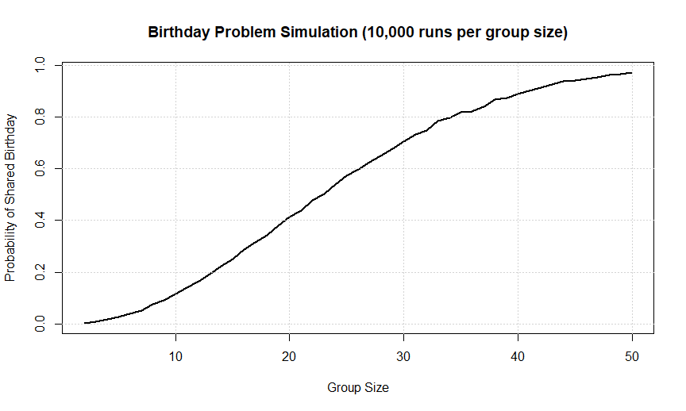
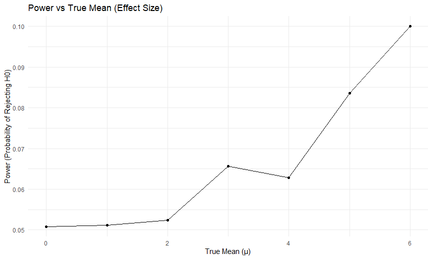
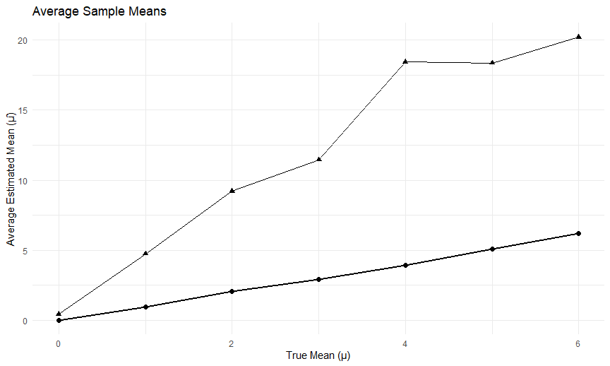
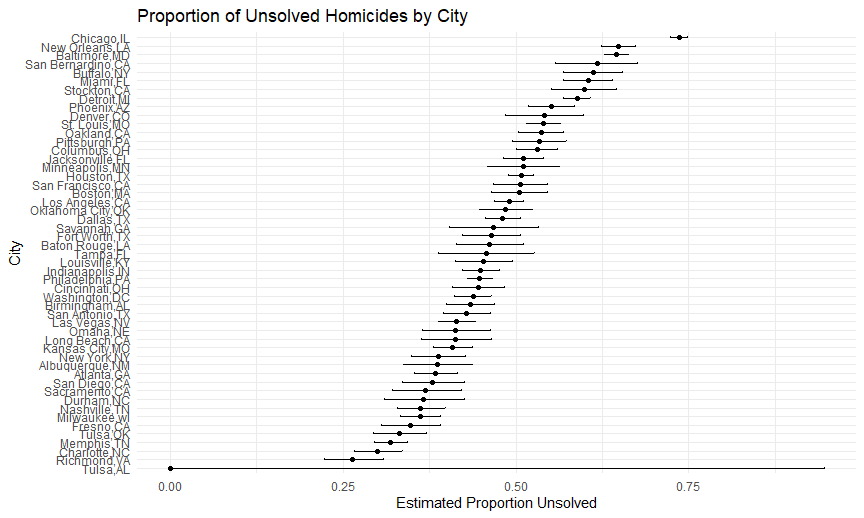

p8105_hw5_jz3899
================
Jicong Zhang
2025-11-13

# Problem 1

``` r
shared_birthday = function(group_size){
  birthdays = sample(1:365, size = group_size, replace = TRUE)
  return(length(unique(birthdays)) < group_size)
}

n_sim = 10000
group_sizes = 2:50
prob_shared = numeric(length(group_sizes))
set.seed(1)

for(i in seq_along(group_sizes)){
  group = group_sizes[i]
  results = replicate(n_sim, shared_birthday(group))
  prob_shared[i] = mean(results)
}

plot(group_sizes, prob_shared,
     type = "l", lwd = 2,
     xlab = "Group Size",
     ylab = "Probability of Shared Birthday",
     main = "Birthday Problem Simulation (10,000 runs per group size)")
grid()
```



# Problem 2

``` r
set.seed(1)
n = 30
sigma = 50
mu = 0:6
nsim = 5000
results = map_df(mu, function(mu_true){
  sims = replicate(nsim, {
    x = rnorm(n, mean = mu_true, sd=sigma)
    test = t.test(x,mu = 0)
    tibble(
      mu_hat = mean(x),
      pval=test$p.value,
      reject = test$p.value <0.05,
      mu_true = mu_true
    )
  },simplify = FALSE)
  bind_rows(sims)
})

power_df = results %>%
  group_by(mu_true) %>%
  summarize(power = mean(reject))

mu_hat_df = results %>%
  group_by(mu_true) %>%
  summarize(mean_mu = mean(mu_hat),
            mean_mu_reject = mean(mu_hat[reject]))
```

``` r
ggplot(power_df, aes(x = mu_true, y = power)) +
  geom_line() +
  geom_point() +
  labs(title = "Power vs True Mean (Effect Size)",
       x = "True Mean (μ)",
       y = "Power (Probability of Rejecting H0)")
```



**Power is low when μ = 0 or close to 0. As μ increases, the probability
of rejecting the false null increases sharply. So larger effect sizes
increase statistical power.**

``` r
ggplot(mu_hat_df, aes(x = mu_true)) +
  geom_line(aes(y = mean_mu), size = 1) +
  geom_point(aes(y = mean_mu), size = 2) +
  geom_line(aes(y = mean_mu_reject)) +
  geom_point(aes(y = mean_mu_reject), shape = 17, size = 2) +
  labs(title = "Average Sample Means",
       x = "True Mean (μ)",
       y = "Average Estimated Mean (μ̂)")
```

    ## Warning: Using `size` aesthetic for lines was deprecated in ggplot2 3.4.0.
    ## ℹ Please use `linewidth` instead.
    ## This warning is displayed once every 8 hours.
    ## Call `lifecycle::last_lifecycle_warnings()` to see where this warning was
    ## generated.



**The overall mean μhat closely matches the true μ.**

# Problem 3

``` r
homi_df =
  read_csv("./homicide-data.csv", na = c("NA",".", "")) %>%
  janitor::clean_names()
```

    ## Rows: 52179 Columns: 12
    ## ── Column specification ────────────────────────────────────────────────────────
    ## Delimiter: ","
    ## chr (9): uid, victim_last, victim_first, victim_race, victim_age, victim_sex...
    ## dbl (3): reported_date, lat, lon
    ## 
    ## ℹ Use `spec()` to retrieve the full column specification for this data.
    ## ℹ Specify the column types or set `show_col_types = FALSE` to quiet this message.

``` r
homi_df
```

    ## # A tibble: 52,179 × 12
    ##    uid        reported_date victim_last  victim_first victim_race victim_age
    ##    <chr>              <dbl> <chr>        <chr>        <chr>       <chr>     
    ##  1 Alb-000001      20100504 GARCIA       JUAN         Hispanic    78        
    ##  2 Alb-000002      20100216 MONTOYA      CAMERON      Hispanic    17        
    ##  3 Alb-000003      20100601 SATTERFIELD  VIVIANA      White       15        
    ##  4 Alb-000004      20100101 MENDIOLA     CARLOS       Hispanic    32        
    ##  5 Alb-000005      20100102 MULA         VIVIAN       White       72        
    ##  6 Alb-000006      20100126 BOOK         GERALDINE    White       91        
    ##  7 Alb-000007      20100127 MALDONADO    DAVID        Hispanic    52        
    ##  8 Alb-000008      20100127 MALDONADO    CONNIE       Hispanic    52        
    ##  9 Alb-000009      20100130 MARTIN-LEYVA GUSTAVO      White       56        
    ## 10 Alb-000010      20100210 HERRERA      ISRAEL       Hispanic    43        
    ## # ℹ 52,169 more rows
    ## # ℹ 6 more variables: victim_sex <chr>, city <chr>, state <chr>, lat <dbl>,
    ## #   lon <dbl>, disposition <chr>

``` r
glimpse(homi_df)
```

    ## Rows: 52,179
    ## Columns: 12
    ## $ uid           <chr> "Alb-000001", "Alb-000002", "Alb-000003", "Alb-000004", …
    ## $ reported_date <dbl> 20100504, 20100216, 20100601, 20100101, 20100102, 201001…
    ## $ victim_last   <chr> "GARCIA", "MONTOYA", "SATTERFIELD", "MENDIOLA", "MULA", …
    ## $ victim_first  <chr> "JUAN", "CAMERON", "VIVIANA", "CARLOS", "VIVIAN", "GERAL…
    ## $ victim_race   <chr> "Hispanic", "Hispanic", "White", "Hispanic", "White", "W…
    ## $ victim_age    <chr> "78", "17", "15", "32", "72", "91", "52", "52", "56", "4…
    ## $ victim_sex    <chr> "Male", "Male", "Female", "Male", "Female", "Female", "M…
    ## $ city          <chr> "Albuquerque", "Albuquerque", "Albuquerque", "Albuquerqu…
    ## $ state         <chr> "NM", "NM", "NM", "NM", "NM", "NM", "NM", "NM", "NM", "N…
    ## $ lat           <dbl> 35.09579, 35.05681, 35.08609, 35.07849, 35.13036, 35.151…
    ## $ lon           <dbl> -106.5386, -106.7153, -106.6956, -106.5561, -106.5810, -…
    ## $ disposition   <chr> "Closed without arrest", "Closed by arrest", "Closed wit…

**There are 52179 rows and 12 columns in this dataset. Some important
variables are reported_date, victim_age, city and state.**

``` r
city_df = homi_df %>%
  mutate(city_state = str_c(city, state, sep = ",")) %>%
  group_by(city_state) %>%
  summarize(
    total = n(),
    unsolved = sum(disposition %in% c("Closed without arrest", "Open/No arrest"))
  )
city_df
```

    ## # A tibble: 51 × 3
    ##    city_state     total unsolved
    ##    <chr>          <int>    <int>
    ##  1 Albuquerque,NM   378      146
    ##  2 Atlanta,GA       973      373
    ##  3 Baltimore,MD    2827     1825
    ##  4 Baton Rouge,LA   424      196
    ##  5 Birmingham,AL    800      347
    ##  6 Boston,MA        614      310
    ##  7 Buffalo,NY       521      319
    ##  8 Charlotte,NC     687      206
    ##  9 Chicago,IL      5535     4073
    ## 10 Cincinnati,OH    694      309
    ## # ℹ 41 more rows

``` r
baltimore = city_df %>%
  filter(city_state == "Baltimore,MD")
bal_prop = prop.test(baltimore$unsolved, baltimore$total)
bal_tidy = broom::tidy(bal_prop)
bal_tidy %>%
  select(estimate, conf.low, conf.high) %>%
  knitr::kable(digits = 3)
```

| estimate | conf.low | conf.high |
|---------:|---------:|----------:|
|    0.646 |    0.628 |     0.663 |

``` r
bal_tidy
```

    ## # A tibble: 1 × 8
    ##   estimate statistic  p.value parameter conf.low conf.high method    alternative
    ##      <dbl>     <dbl>    <dbl>     <int>    <dbl>     <dbl> <chr>     <chr>      
    ## 1    0.646      239. 6.46e-54         1    0.628     0.663 1-sample… two.sided

``` r
homicides_props = city_df %>%
  mutate(
    test_results = map2(unsolved, total, ~ prop.test(.x, .y)),
    tidy_results = map(test_results, broom::tidy)
  ) %>%
  unnest(tidy_results) %>%
  select(city_state, estimate, conf.low, conf.high, total, unsolved)
```

    ## Warning: There was 1 warning in `mutate()`.
    ## ℹ In argument: `test_results = map2(unsolved, total, ~prop.test(.x, .y))`.
    ## Caused by warning in `prop.test()`:
    ## ! Chi-squared近似算法有可能不准

``` r
homicides_props
```

    ## # A tibble: 51 × 6
    ##    city_state     estimate conf.low conf.high total unsolved
    ##    <chr>             <dbl>    <dbl>     <dbl> <int>    <int>
    ##  1 Albuquerque,NM    0.386    0.337     0.438   378      146
    ##  2 Atlanta,GA        0.383    0.353     0.415   973      373
    ##  3 Baltimore,MD      0.646    0.628     0.663  2827     1825
    ##  4 Baton Rouge,LA    0.462    0.414     0.511   424      196
    ##  5 Birmingham,AL     0.434    0.399     0.469   800      347
    ##  6 Boston,MA         0.505    0.465     0.545   614      310
    ##  7 Buffalo,NY        0.612    0.569     0.654   521      319
    ##  8 Charlotte,NC      0.300    0.266     0.336   687      206
    ##  9 Chicago,IL        0.736    0.724     0.747  5535     4073
    ## 10 Cincinnati,OH     0.445    0.408     0.483   694      309
    ## # ℹ 41 more rows

``` r
homicides_props %>%
  mutate(city_state = fct_reorder(city_state, estimate)) %>%
  ggplot(aes(x = city_state, y = estimate)) +
  geom_point() +
  geom_errorbar(aes(ymin = conf.low, ymax = conf.high), width = 0.2) +
  coord_flip() +
  labs(
    title = "Proportion of Unsolved Homicides by City",
    x = "City",
    y = "Estimated Proportion Unsolved"
  )
```


